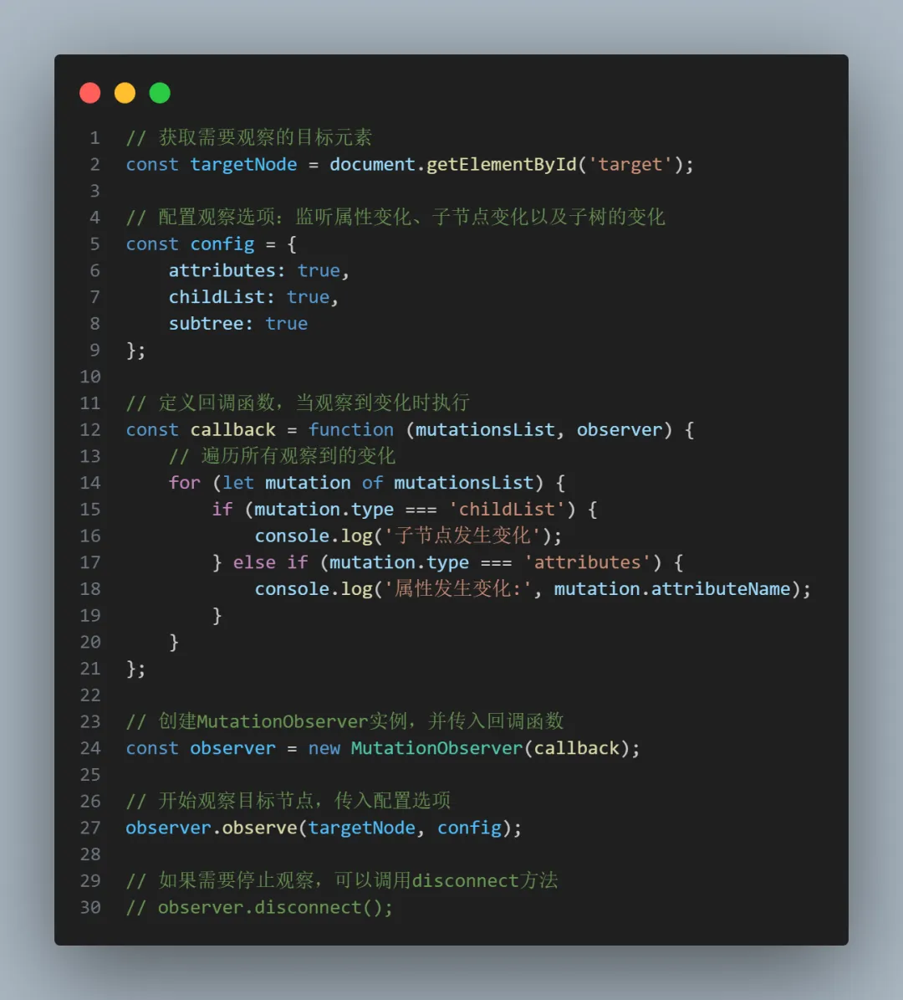
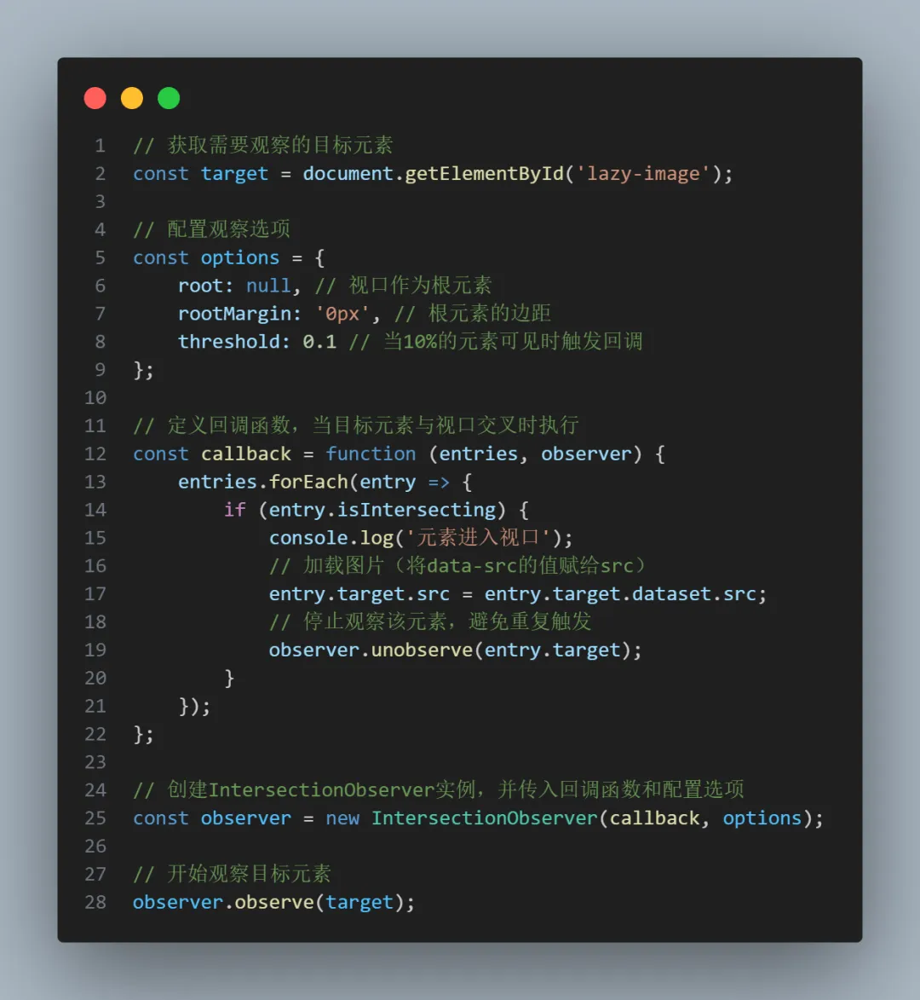
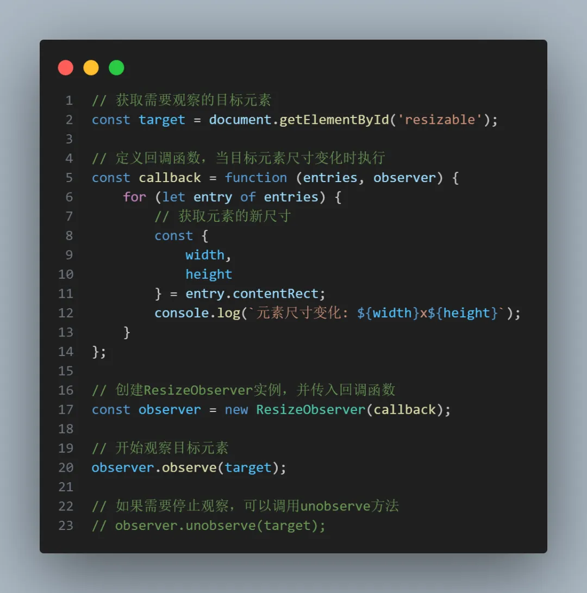
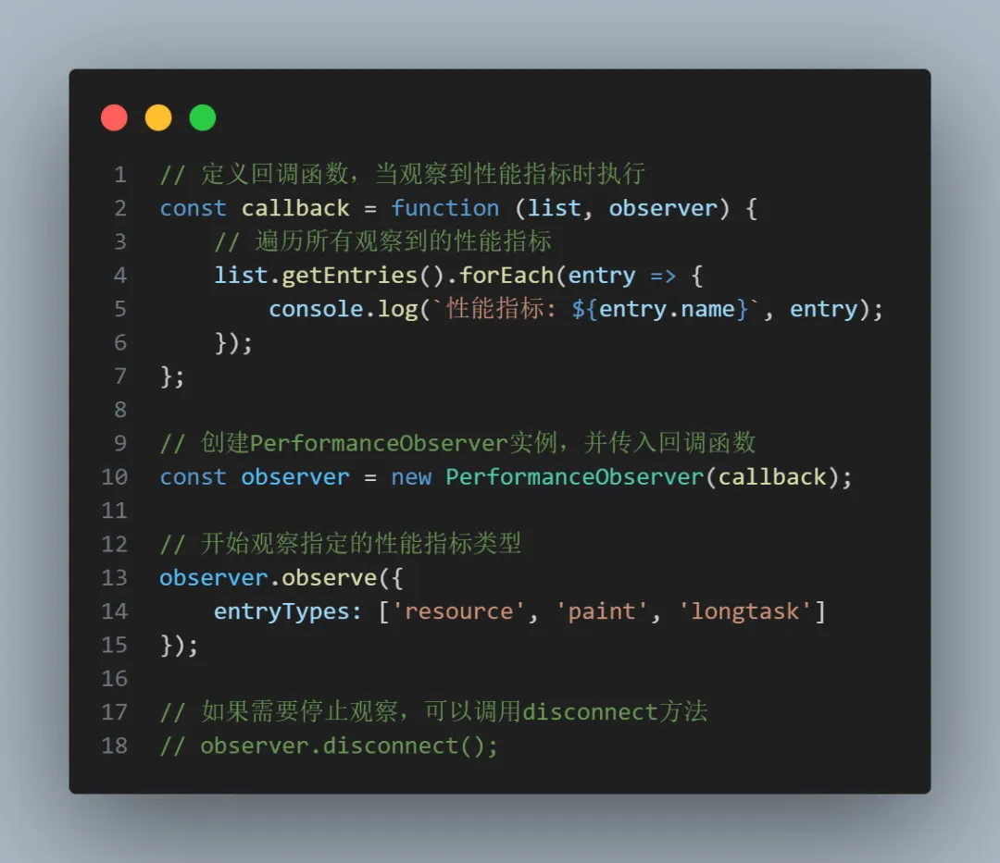

# 如何封装命令式组件
使用createApp创建组件 然后挂载到dom上 doSomething然后卸载组件
```js
// 
import { createApp } from "vue"
import MessageBox from "@/components/message-box.vue"

function showMsg(msg: string, callback: Function) {
    const msgBox = document.createElement('div')
    document.body.appendChild(msgBox)

    // 创建组件
    const app = createApp(MessageBox, {
        msg,
        handleClick() {
            callback && callback()
            app.unmount()
            document.body.removeChild(msgBox)
        }
    })
    // 渲染组件
    app.mount(msgBox)
}

export default showMsg
```

使用如下
```js
<script setup lang="ts">
import { ElButton } from 'element-plus'
import showMsg from '@/composables/showMsg'

const open = () => {
    showMsg('你好', () => {
        doSomething()
    })
}
</script>
```

# vue2 extends后修改或劫持方法 
vue2的继承 mixins 会覆盖同名的 methods 可以通过以下方式劫持或修改方法
```js
const RawTemplate =  Vue.extend(OriginalTemplate) || loadComponent(OriginalTemplate)
export default {
    name: 'NewTemplate',
    extends: RawTemplate,
    methods: {
        ...RawTemplate.methods,
        // 劫持或修改方法
        newMethod() {
            // 劫持或修改方法
            dosomething()
            await RawTemplate.methods.someFun.call(this,args1,args2)
            dosomething()
        }
    }
}

# 浏览器常用的snippets  
https://bgrins.github.io/devtools-snippets/

```js
/**
 * 
 * 
**/
(function(console){
    console.save = function(data, filename){

        if(!data) {
            console.error('Console.save: No data')
            return;
        }

        if(!filename) filename = 'console.json'

        if(typeof data === "object"){
            data = JSON.stringify(data, undefined, 4)
        }

        var blob = new Blob([data], {type: 'text/json'}),
            e    = document.createEvent('MouseEvents'),
            a    = document.createElement('a')

        a.download = filename
        a.href = window.URL.createObjectURL(blob)
        a.dataset.downloadurl =  ['text/json', a.download, a.href].join(':')
        e.initMouseEvent('click', true, false, window, 0, 0, 0, 0, 0, false, false, false, false, 0, null)
        a.dispatchEvent(e)
    }
})(console)
```

```js
/*
	log-globals
	by Sindre Sorhus
	https://github.com/sindresorhus/log-globals
	MIT License
*/
(function () {
	'use strict';

	function getIframe() {
		var el = document.createElement('iframe');
		el.style.display = 'none';
		document.body.appendChild(el);
		var win = el.contentWindow;
		document.body.removeChild(el);
		return win;
	}

	function detectGlobals() {
		var iframe = getIframe();
		var ret = Object.create(null);
		for (var prop in window) {
			if (!(prop in iframe)) {
				ret[prop] = window[prop];
			}
		}
		return ret;
	}
	console.log(detectGlobals());
})();
```

# MutationObserver 监听DOM变化

使用场景
动态加载内容时，监听新元素的插入。
监听元素的属性变化，如class、style等。
监听子节点的变化，如添加或删除子元素。

  


# IntersectionObserver 监听元素可见性
IntersectionObserver用于监听目标元素与其祖先元素或视口的交叉状态。它可以帮助开发者判断元素是否进入或离开视口，从而实现懒加载、无限滚动等功能。
## 使用场景
- 图片懒加载：当图片进入视口时再加载。
- 无限滚动：监听列表底部元素，触发加载更多内容。
- 广告曝光统计：统计广告元素的曝光次数。

  

# ResizeObserver 监听元素尺寸变化

ResizeObserver用于监听元素尺寸的变化。与传统的 window.resize 事件不同，ResizeObserver可以精确监听单个元素的尺寸变化，而不受页面其他部分的影响。
## 使用场景
- 响应式布局：根据元素尺寸动态调整布局。
- 图表重绘：当容器尺寸变化时，重新绘制图表。
- 自适应组件：根据父容器尺寸调整子组件大小。

  

# PerformanceObserver 监听性能指标
PerformanceObserver 用于监听性能相关的指标，如资源加载时间、首次绘制时间等。它可以帮助开发者分析和优化页面性能。
## 使用场景
监控页面加载性能。
分析资源加载时间。
监控长任务和用户交互延迟。

  
